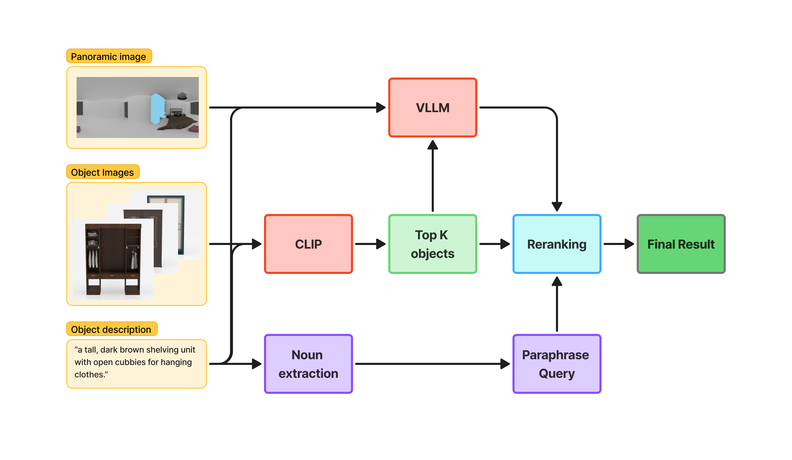

# BUCCI_GANG_SYSTEM
<p align="center">
  
</p>

This tool matches furniture objects to scenes based on text descriptions and context image using a combination of CLIP and InternVL models. It processes scenes with masked areas and finds the most suitable objects to place in those areas based on visual and textual similarity.

## Features

- **CLIP-based object retrieval**: Uses OpenCLIP to find initial object candidates based on text descriptions
- **Natural language processing**: Extracts key noun phrases from queries using spaCy
- **InternVL re-ranking**: Evaluates how well objects fit in the scene context
- **Weighted fusion**: Combines CLIP and InternVL scores for optimal ranking


## Installation

1. Clone this repository:
   ```bash
   git clone https://github.com/Hungquan5/ROOM_ELSA_BUCCI_GANG
   cd ROOM_ELSE_BUCCI_GANG
   ```

2. Install dependencies:
   ```bash
   pip install -r requirements.txt
   ```

3. Download required spaCy model:
   ```bash
   python -m spacy download en_core_web_trf
   ```

## Directory Structure

Your data should be organized as follows:

```
scenes/
├── 01/
│   ├── masked.png    # Scene image with masked area
│   └── query.txt     # Text description of object needed
├── 02/
│   ├── masked.png
│   └── query.txt
└── ...

objects/
├── object1/
│   └── image.jpg     # Object image
├── object2/
│   └── image.jpg
└── ...
```

## Usage

Basic usage:

```bash
python main.py  --scenes-dir /path/to/scenes \
                --objects-dir /path/to/objects \
                --output-dir /path/to/output
```

### Command Line Arguments

| Argument | Description | Default |
|----------|-------------|---------|
| `--scenes-dir` | Directory containing scene folders | (required) |
| `--objects-dir` | Directory containing object folders | (required) |
| `--output-dir` | Root directory for output | (required) |
| `--internvl-model` | InternVL model path or name | OpenGVLab/InternVL2_5-2B |
| `--clip-model` | CLIP model name | ViT-SO400M-14-SigLIP-384 |
| `--clip-pretrained` | CLIP pretrained weights | webli |
| `--spacy-model` | spaCy model name | en_core_web_trf |
| `--top-k` | Number of images to save | 10 |
| `--eval-k` | Number of top images to evaluate with InternVL | 3 |
| `--input-size` | Input image size for models | 448 |
| `--max-patches` | Maximum number of patches for preprocessing | 12 |
| `--phrase-weight` | Weight for original query vs phrases (0.0-1.0) | 0.25 |
| `--internvl-weight` | Weight for InternVL scores in fusion (0.0-1.0) | 0.25 |
| `--internvl-device` | Device for InternVL model | cuda:0 |
| `--clip-device` | Device for CLIP model | cuda:1 |

### Examples

Run with default parameters:

```bash
python main.py --scenes-dir ./scenes --objects-dir ./objects --output-dir ./output
```

Run with custom weight parameters:

```bash
python scene_object_matcher.py --scenes-dir ./scenes \
                             --objects-dir ./objects \
                             --output-dir ./output \
                             --phrase-weight 0.3 \
                             --internvl-weight 0.4
```

Run with both models on a single GPU:

```bash
python scene_object_matcher.py --scenes-dir ./scenes \
                             --objects-dir ./objects \
                             --output-dir ./output \
                             --internvl-device cuda:0 \
                             --clip-device cuda:0
```

## Output

For each scene, the tool creates a subdirectory in the output directory containing:
- `scene.jpg` - Copy of the original scene image
- `query.txt` - Original text query
- `phrases.txt` - Extracted noun phrases from the query
- `top1.jpg`, `top2.jpg`, etc. - Top-K ranked object images

Additionally, a `results.csv` file is created in the output directory with scene names and corresponding object IDs.

## How It Works

1. **Object Encoding**: All object images are encoded using the CLIP model
2. **Query Processing**: For each scene:
   - Text query is processed to extract relevant noun phrases
   - Both original query and extracted phrases are encoded with CLIP
   - Initial ranking is done using weighted combination of similarities
3. **Re-ranking**: 
   - Top-K candidates are selected based on CLIP similarity
   - Top eval-K candidates are evaluated using InternVL for contextual fit
   - Final ranking uses a weighted fusion of CLIP and InternVL scores
4. **Output Generation**: Ranked objects are saved along with original scene and query

